Demo: https://ecstyletheme.myshopify.com/

# COSMETIC SHOPIFY THEME

## STANDARD SECTIONS

* Blogs
* Customizable contact form
* FAQ page
* Promo Countdown
* Newsletter popup
* Customer reviews
* Quick view
* Recently viewed
* Recommended products
* Wislish
* Compare products
* Color swatches
* Image zoom
* Product tabs
* Shipping/delivery information
* Slideshow
* Usage information

## Product discovery

* Breadcrumbs
* Collection pagination, ajax load more, infiniteScroll
* Collection view grid and list layout
* Enhanced search
* Mega menu
* Product filtering and sorting
* Recently viewed
* Recommended products
* Sticky header
 
## Cart & checkout
 
* Progress Bar Shipping
* Quick buy
* Notification popup combine a dropdown cart

## USE MENU

We have 4 layouts for megamenu. Base on Title of Top Level. If it matches with the setting in each block after that it will show below.

1. Go to Online Store -> Themes -> Customize -> Sections

2. Header sections -> Add block ( Mega menu layout 1, Mega menu layout 2, Mega menu layout 3, Mega menu layout 4 )

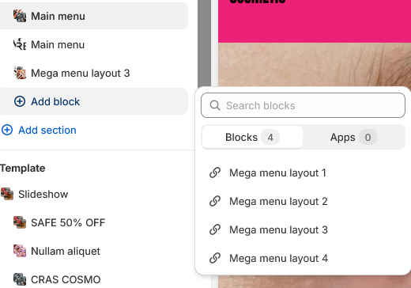

### Layout 1

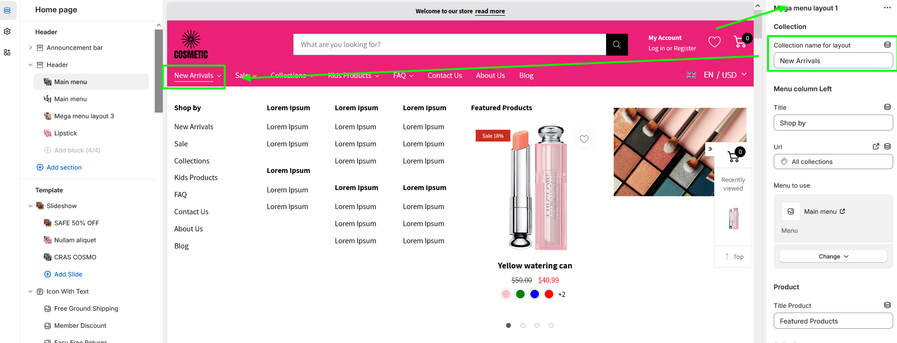


### Layout 2

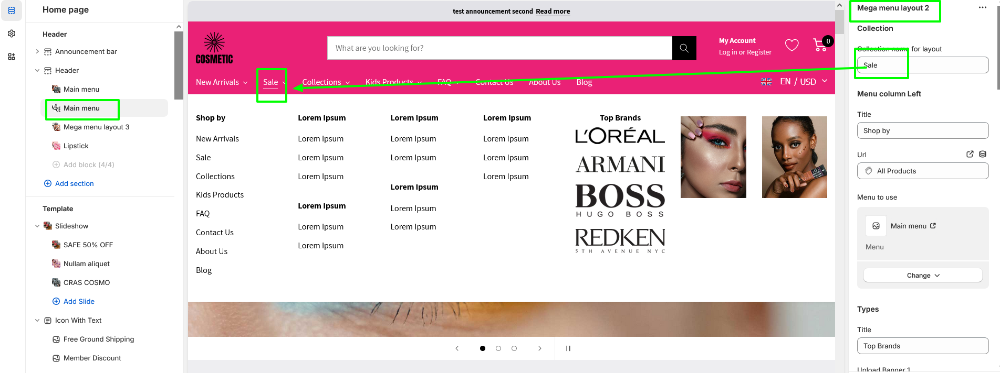

### Layout 3

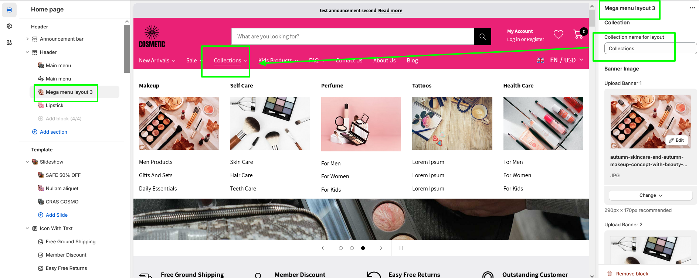

### Layout 4

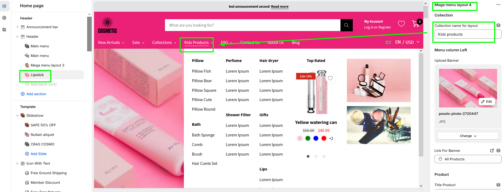


## USE COUNTDOWN ON PRODUCT DETAIL PAGE

To enbable countdown on product detail page. We need follow step by step below:


1. Go to Online Store -> Themes -> Customize button -> Settings

2. Expand Product tab -> click Enable Countdown? to enable this featured

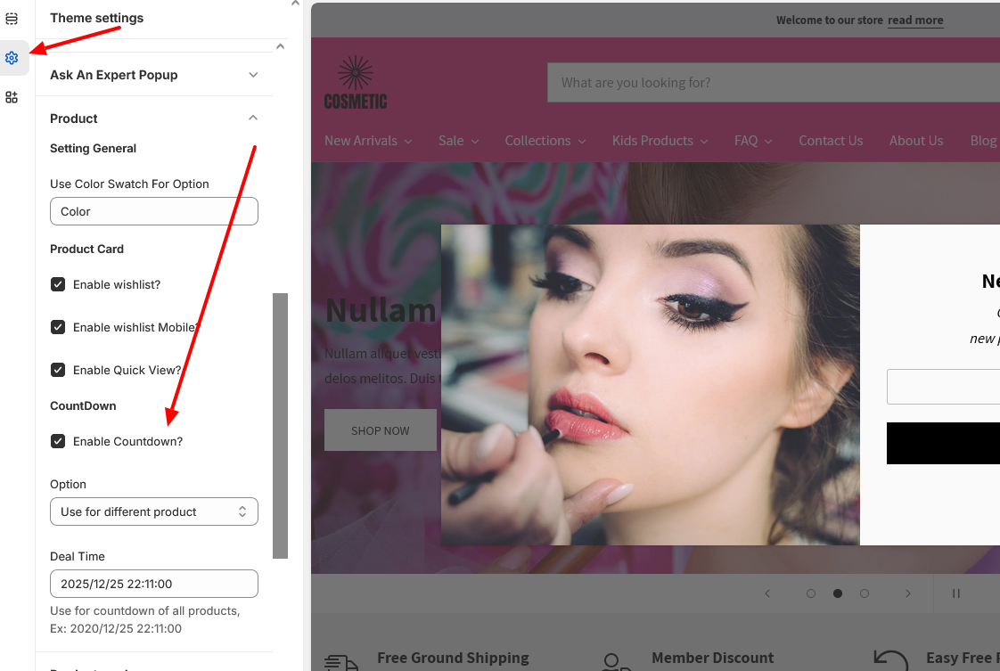

3. Select option 

	- Use for all products -> If you chose this option After that go to step 4 
	- Use for different product -> If you chose this option. After that go to step 5

4. Add a deal time with a format like "2025/12/25 22:11:00". This time must be greater than the current time.

5. Go to Content->Metaobjects-> Manage definitions


6. Go to Products -> click Add definition button on top right 


7. Create a metafield

```bash

Namespace: custom
Key: countdown
Type: Date and time

```


8. Go to  products -> Select product that you would like to show count down

9. Add a deal time for this product. This time must be greater than the current time.


## USE PROGRESS SHIPPING (both cart drawer and cart page)


1. Go to Online Store -> Themes -> Customize button
2. Settings -> Progress Bar Shipping -> check Enable Progress Bar shipping to turn on it
3. Add total price, messages for free shipping


## SETTING TO SHOW WISHLIST


1. Go to Online Store -> Themes -> Customize button -> Settings

2. Expand Product tab -> click "Enable Wishlist?" to show wishlist icon on card product and product detail page


3. Go to Sections -> Header section -> check "Enable Header Wishlist" 


3.  Go to Online Store -> Pages -> Create wishlist page

```bash

URL and handle: wish-list
Theme template: wishlist

```


## TURN ON ASK AN EXPERT POPUP

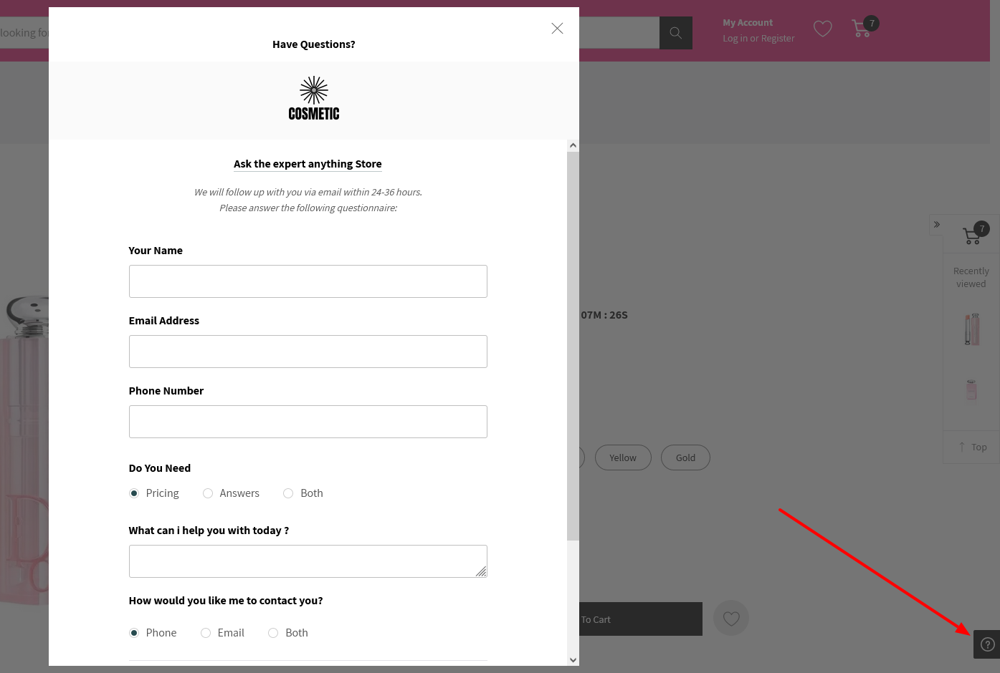

1. Go to Online Store -> Themes -> Customize button -> Settings
2. Expand Product tab -> click "Enable Wishlist?" to show wishlist icon on card product and product detail page
3. Setup your setting

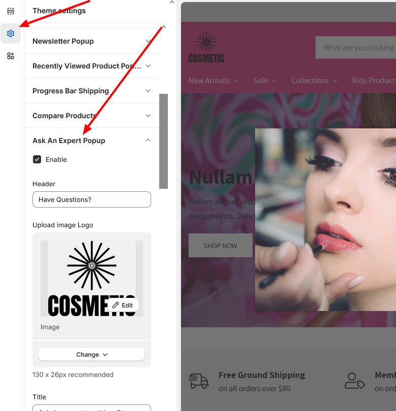

## TURN ON QUICK VIEW ON THE PRODUCT CARD

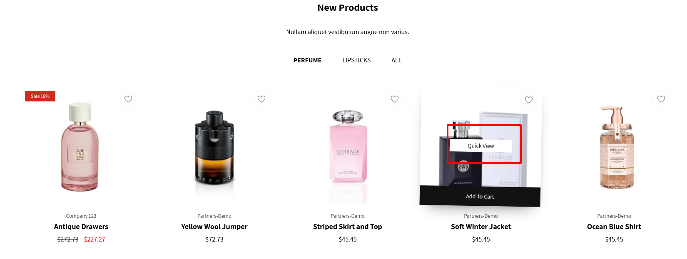

1. Go to Online Store -> Themes -> Customize button -> Settings

2. Expand Product tab -> click "Enable Quick View??" to show Quick View button

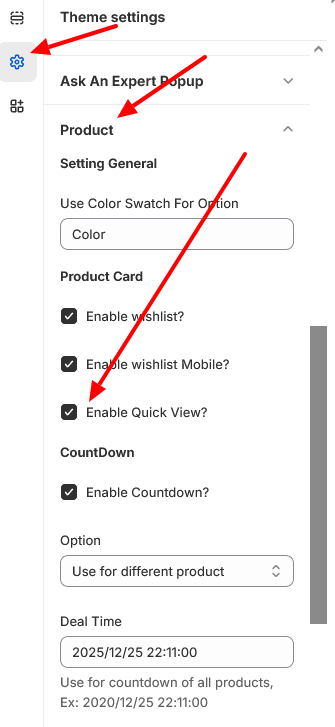


## TURN ON THE COMPARISON ON THE COLLECTION PAGE

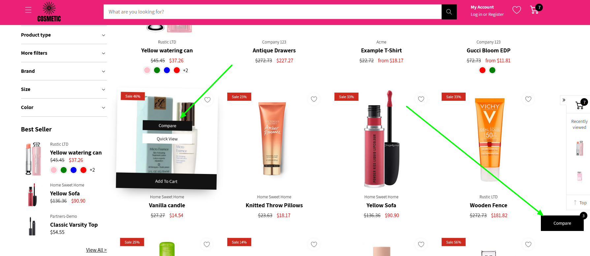

1. Go to Online Store -> Themes -> Customize button -> Theme settings
2. Expand Compare Products tab
3. Turn on/of. Setup color ...


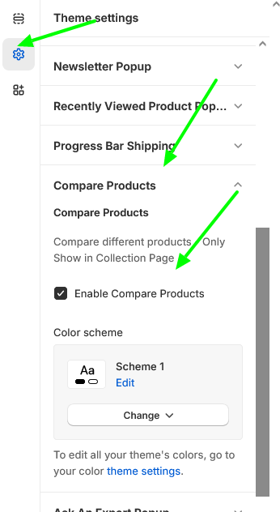

## TURN ON THE RECENTLY VIEWED PRODUCT POPUP

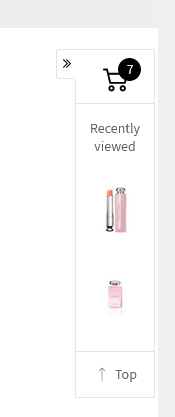

1. Go to Online Store -> Themes -> Customize button -> Theme settings
2. Recently Viewed Product Popup tab


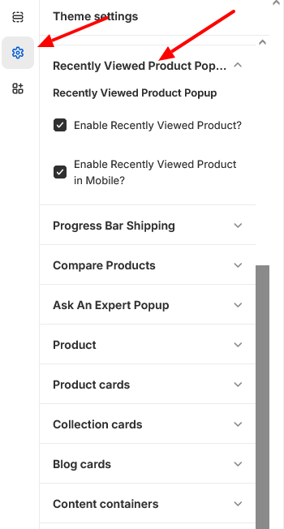

## SETTINGS SEARCH FORM

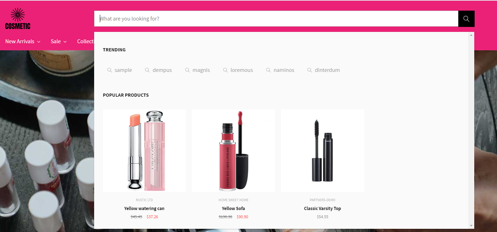

1. Go to Online Store -> Themes -> Customize button -> Theme settings
2. Search Form tab


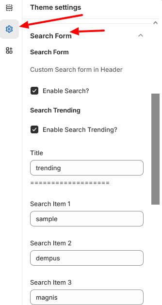

## ADD LOGOS FOR MULTIPLE LANGUAGE/CURRECY

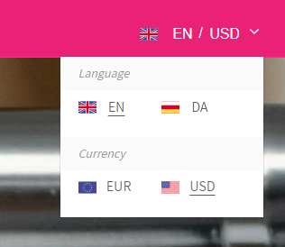

1. Go to Online Store -> Themes -> Customize button -> Theme settings
2. Multiple Language / Currency Tabs

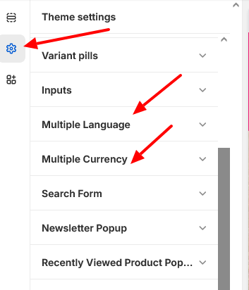

## HOME PAGE


## COLLECTION PAGE


 
##  PRODUCT DETAIL PAGE

 


##  CART PAGE

 


## Bugs/Feature Requests & Contribution

Please do open a pull request on GitHub should you want to contribute, or create an issue.

## License
[BSD-4-Clause](http://directory.fsf.org/wiki/License:BSD_4Clause) - Do as you wish 👍

## Our website

https://www.eboosttech.net

[DONATE](https://paypal.me/eboost10)  `❤❤❤`
