Demo: https://ecstyletheme.myshopify.com/

# COSMETIC SHOPIFY THEME

## STANDARD SECTIONS

* Blogs
* Customizable contact form
* FAQ page
* Promo Countdown
* Newsletter popup
* Customer reviews
* Quick view
* Recently viewed
* Recommended products
* Wislish
* Compare products
* Color swatches
* Image zoom
* Product tabs
* Shipping/delivery information
* Slideshow
* Usage information

## Product discovery

* Breadcrumbs
* Collection pagination, ajax load more, infiniteScroll
* Collection view grid and list layout
* Enhanced search
* Mega menu
* Product filtering and sorting
* Recently viewed
* Recommended products
* Sticky header
 
## Cart & checkout
 
* Progress Bar Shipping
* Quick buy
* Notification popup combine a dropdown cart

## USE COUNTDOWN ON PRODUCT DETAIL PAGE

To enbable countdown on product detail page. We need follow step by step below:

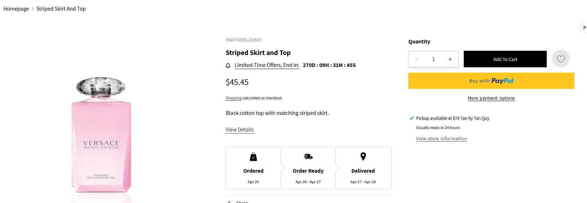


1. Go to Online Store -> Themes -> Customize button -> Settings

2. Expand Product cards -> click Enable Countdown? to enable this featured

3. Select option 
	- Use for all products -> If you chose this option After that go to step 4 
	- Use for different product -> If you chose this option. After that go to step 5

4. Add a deal time with a format like "2025/12/25 22:11:00". This time must be greater than the current time.

5. Go to Content->Metaobjects-> Manage definitions

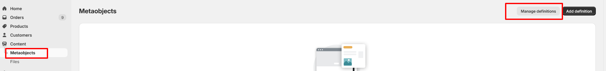

6. Go to Products -> click Add definition button on top right 

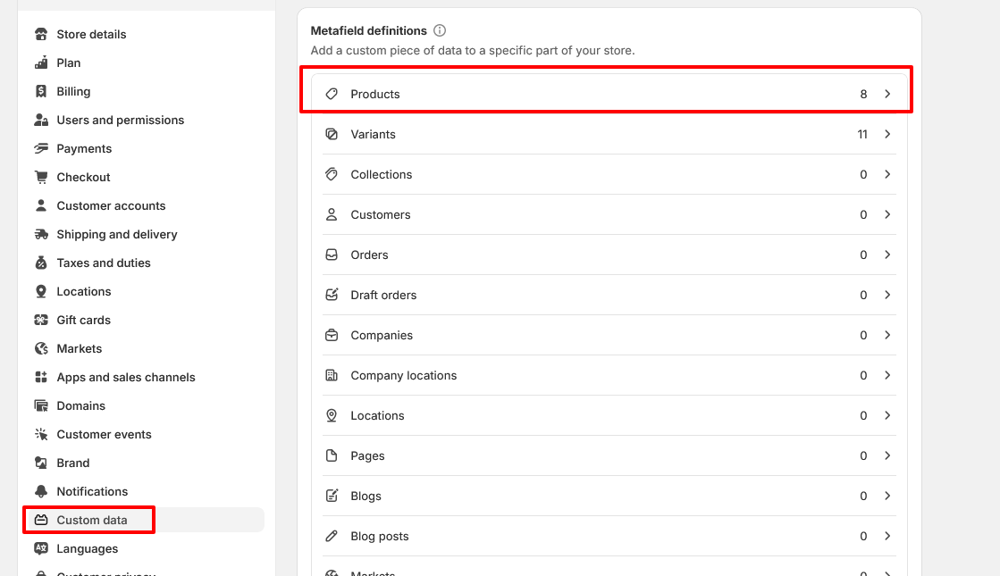

7. Create a metafield

```bash

Namespace: custom
Key: countdown
Type: Date and time

```
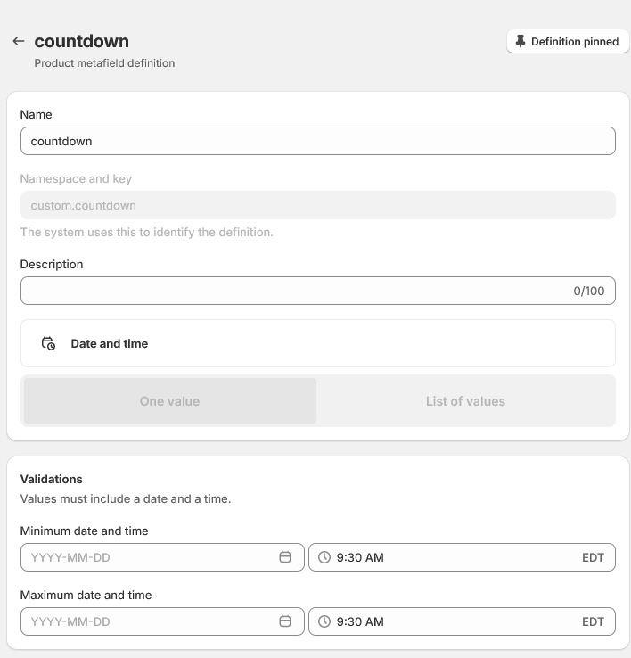


8. Go to  products -> Select product that you would like to show count down

9. Add a deal time for this product. This time must be greater than the current time.

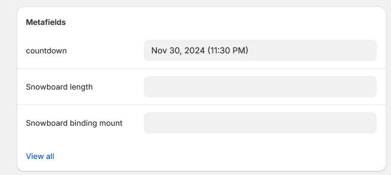

## USE PROGRESS SHIPPING (both cart drawer and cart page)

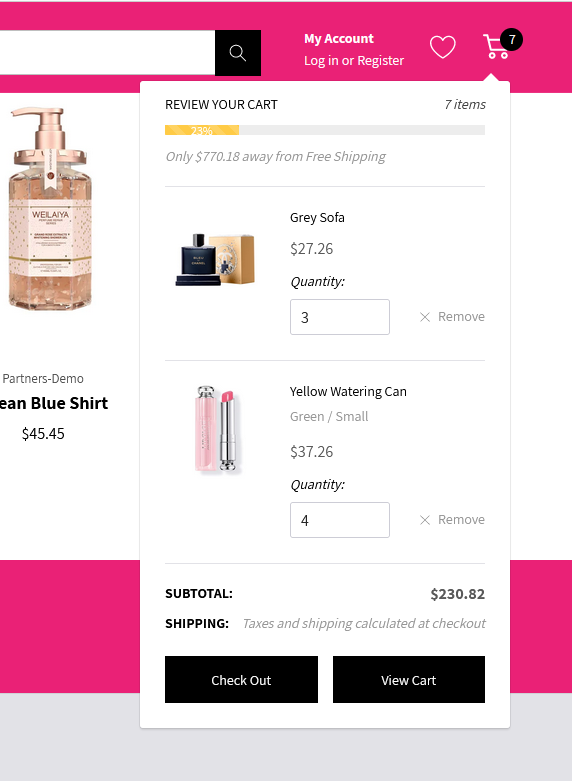


1. Go to Online Store -> Themes -> Customize button
2. Settings -> Progress Bar Shipping -> check Enable Progress Bar shipping to turn on it
3. Add total price, messages for free shipping

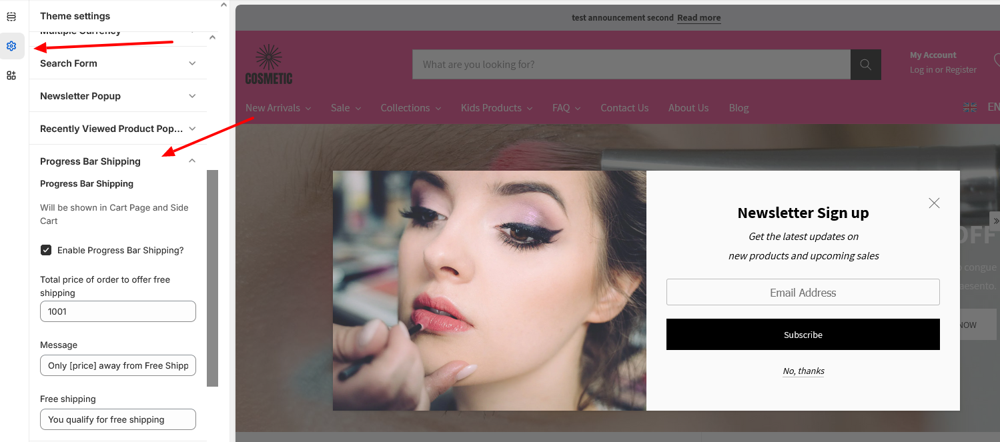


## SETTING TO SHOW WISHLIST


1. Go to Online Store -> Themes -> Customize button -> Settings

2. Expand Product tab -> click "Enable Wishlist?" to show wishlist icon on card product and product detail page

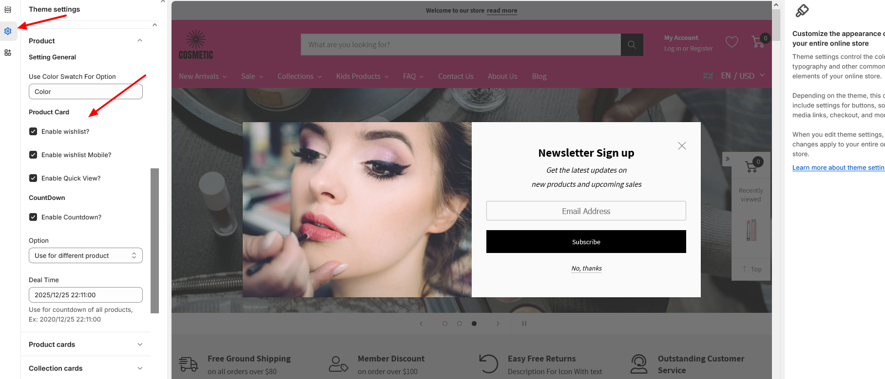

3. Go to Sections -> Header section -> check "Enable Header Wishlist" 

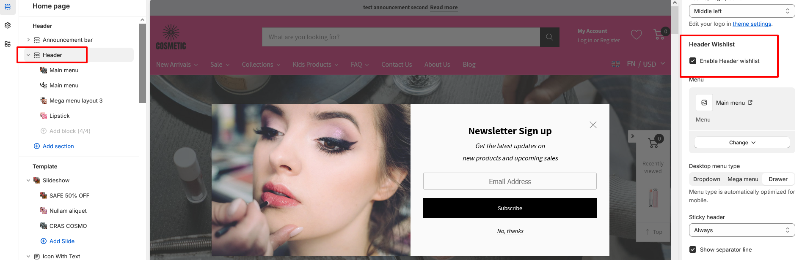

3.  Go to Online Store -> Pages -> Create wishlist page

```bash

URL and handle: wish-list
Theme template: wishlist

```

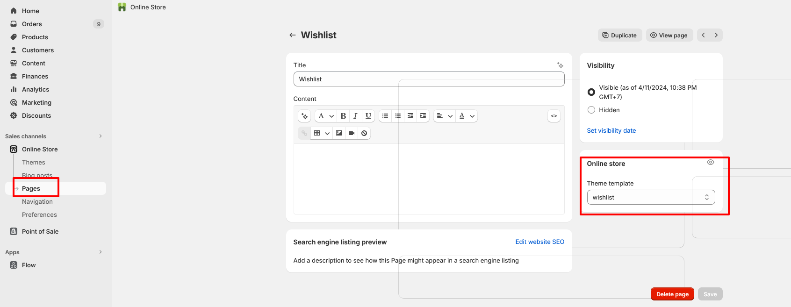


## HOME PAGE


## COLLECTION PAGE

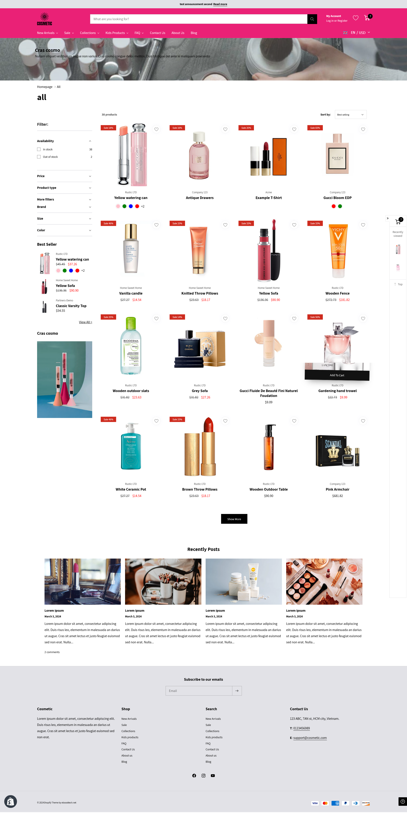

 
##  PRODUCT DETAIL PAGE

 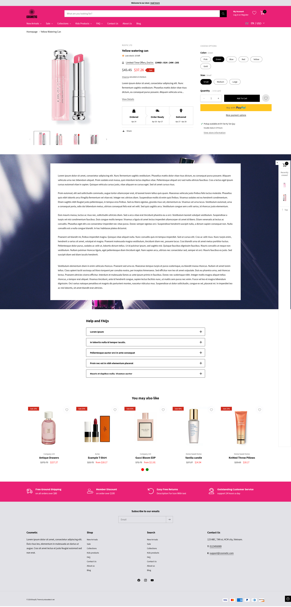


##  CART PAGE

 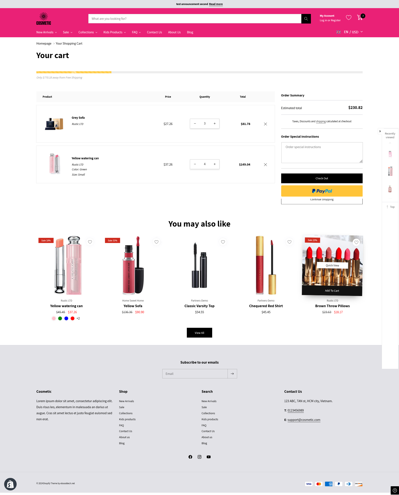


## Bugs/Feature Requests & Contribution

Please do open a pull request on GitHub should you want to contribute, or create an issue.

## License
[BSD-4-Clause](http://directory.fsf.org/wiki/License:BSD_4Clause) - Do as you wish 👍

## Our website

https://www.eboosttech.net

[DONATE](https://paypal.me/eboost10)  `❤❤❤`
